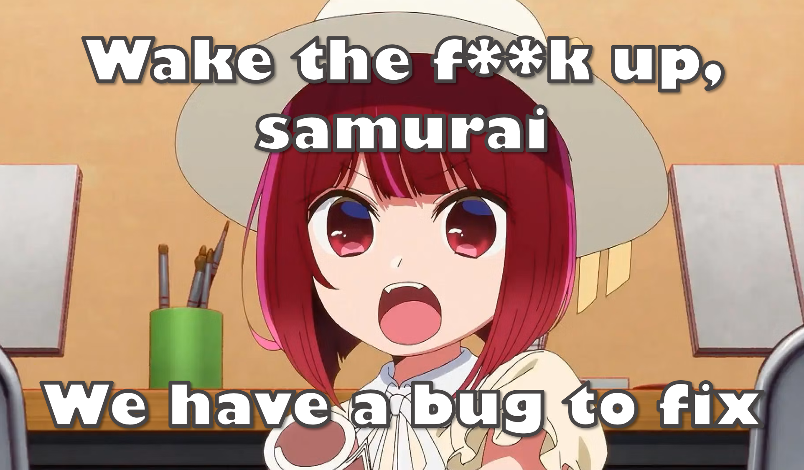

# Bubble Boy
The King of Bubble Tea
<h1 align="center">Hi 👋, I'm arima kana boy</h1>
<h3 align="center">Never resign when you still have hassar.</h3>

- 🔭 I’m currently working on **BubbleTeaBI**

- 🌱 I’m currently learning **python and CICD**

- 👯 I’m looking to collaborate on **Bioinformatics**

- 💬 Ask me about **sf**

- 📫 How to reach me **github**

<h3 align="left">Languages and Tools:</h3>

      

<h3 align="left">Hey guys:</h3>

